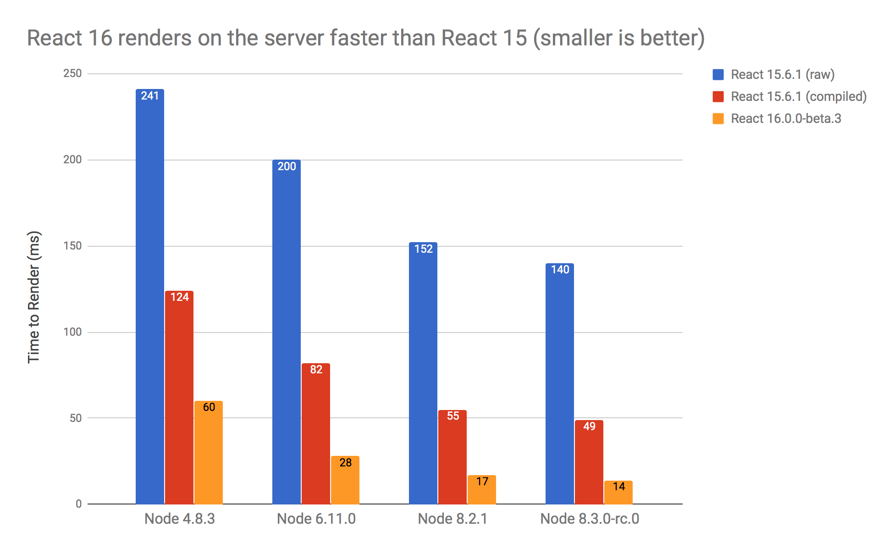

# react-16-ssr-perf

This repo contains the code for the benchmark used in my Medium article ["What’s New With Server-Side Rendering in React 16"](https://todo).



Please note that the benchmark is **very** synthetic, and you will probably not see these kinds of results in real-world use. If you have better React SSR benchmarks, please drop a line and let me know!

## How to install

```
git clone https://github.com/aickin/react-16-ssr-perf.git
cd react-16-ssr-perf
```

## How to run

There are three branches, which correspond to the three different test conditions in the graph above:

* new-prod-mode-15: React 15 (raw)
* new-prod-mode-inline-env-15: React 15 (compiled)
* new-prod-mode-16: React 16

To run the benchmark, checkout the branch you want, reinstall dependencies, and then type `npm run benchmark`. For example, if you want to run React 15 (compiled):

```
git checkout new-prod-mode-inline-env-15
rm -rf node_modules && npm install
npm run benchmark
```
